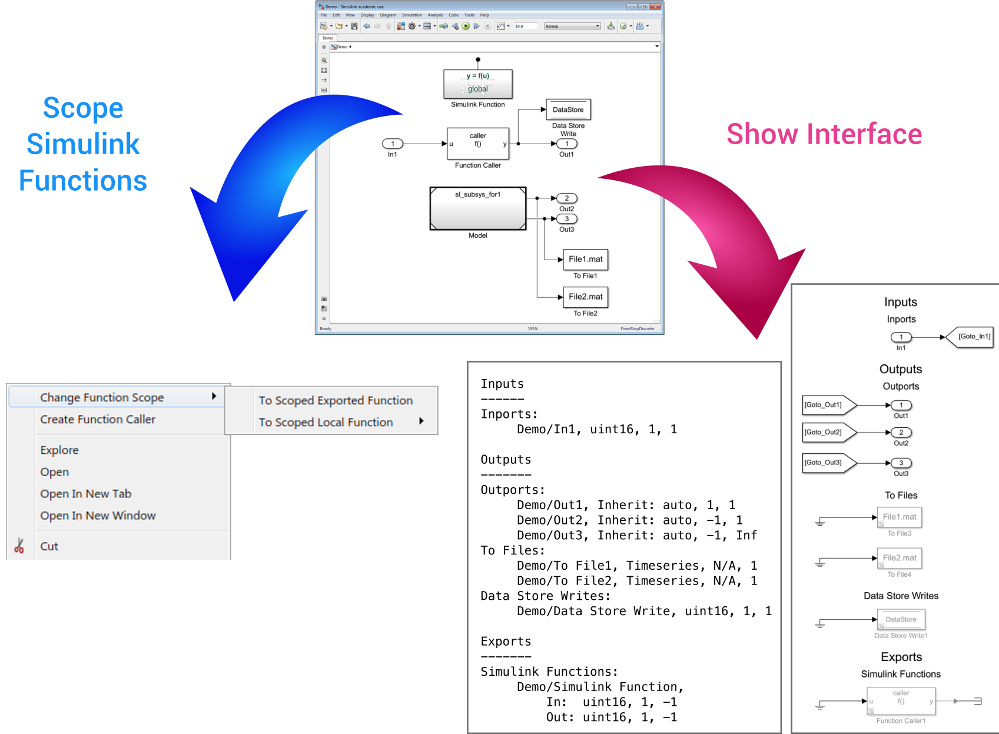

# Simulink Module Tool

The Simulink Module Tool performs several functions in order to support modular development for Simulink models: 

* Scoping Simulink Functions
* Creating pre-configured Function callers
* Visualizing or printing a syntactic interface
* Listing module dependencies
* Checking guidelines

## User Guide
For installation and other information, please see the [User Guide](doc/SimulinkModule_UserGuide.pdf).

This tool is also available for download on the [Matlab Central File Exchange](https://www.mathworks.com/matlabcentral/fileexchange/71952-simulink-module-tool).
